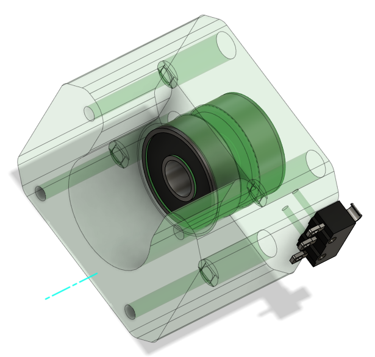
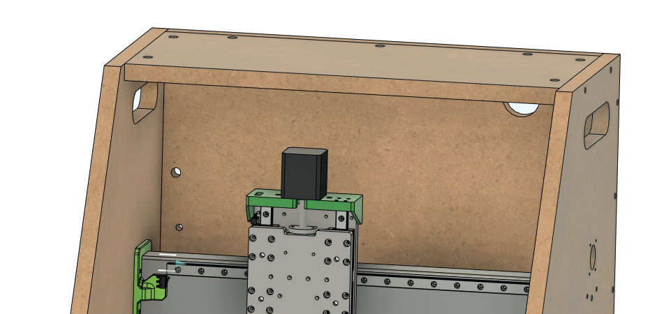

# Assembly

## Table of Contents

[Tapping and Assembling the X and Z Axis Assembly](#xz-sub)

## X and Z axis Sub
(#xz-sub)

Tap 

M3x10 SHCS to bolt to carriage  

M3 nuts pressed into mount  
M3x12 SHCS to bolt to plate

M2x12mm bolts  
Solder wires before bolting  
Run wire through slot  

M3x10 screws into motor  
Make sure lead nut is mounted now

M4x12 SHCS to plate  
M4 self tapping screws if using plastic plates

M4x12 SHCS to Z plate  

M3x10 SHCS to plate  

Put all z bearings on rails  

Put spacers over bearings  
Drill out the bolt holes if needed to make sure the bolts slip through cleanly  

M3x10 SHCS to hearing blocks 
M3x10 SHCS through Z nut to mount, Use holes in z motor mount to slip allen key through and access bolts

Press mounts into the sides of the tube. Sometimes these need to be pounted in with a mallet  
I usually use a 2x4 over the plastic to avoid breaking it  

## Cr8 Start

Press the jig into large holes in the frame to align your side drills  

Drill the holes about 10mm past the dowel hole to allow for bolt clearance

Build up Cr8 with 3 sides like this  

Put lock washer, and nuts on the side of 2 threaded rods  

Put through the X holes  

Lie the Box on its side

Slide the X-Z Sub over the threaded rods all the way down. This can be a little fiddly but this is the easiest way.  

 

## Y Axis Start

Punch drill and tap all holes

M5x25 SHCS in the middle holes of the mounts.  

Slide the last two threaded rods in the outer holes through the tubes. Ive found it can be helpful to lay the frame on it's back so you are droppin the threaded rod through the holes.  

Press 1 608 bearing into the front and back of each thrust block.  

Put the coupler on the motor shaft 10.5mm (ish) from the motor face

Slide the shaft collar and one M8 washer onto the leadscrew and then slide the leadscrew through the thrust block.

On the inside of the thrust block, slide the thrust bearing stack onto the lead screw and then tighten the coupler onto the lead screw.

4- M3x50 SHCS to bolt through the thrust block to the motor

Pull the lead screw away from the motor and press the shaft collar against the thrust block while tightening the set screw. - the goal is to remove the possibility for axial play. 

Solder the wires for the limit switch and use an M2x12 SHCS to bolt it the thrust block with 2 small holes in the side.  

Put the coupler on the motor shaft 11.5mm (ish) from the motor face

Slide the shaft collar and one M8 washer onto the leadscrew and then slide the leadscrew through the thrust block.

On the inside of the thrust block, slide the thrust bearing stack onto the lead screw and then tighten the coupler onto the lead screw.

4- M3x50 SHCS to bolt through the thrust block to the motor

Pull the lead screw away from the motor and press the shaft collar against the thrust block while tightening the set screw. - the goal is to remove the possibility for axial play. 

Y Leadnut mount - press M3 nuts into the pockets and screw to the leadnut

M3x16 FHCS for all the carriages and lead nut mount

Loosen all the screws on one side to make it easier to slide the top in and loosely bolt it in.  

## Window

Screw all the window mounts to the Cr8 with 3/4" wood screws. Pay attention to the hinge mount holes on the top mounts. 

M3x12 SHCS bolted through the window 

M3 plastic tap screws or M3 SHCS to bolt the hinges to the top mounts.

M5x25 SHCS for hinge pins

## Spindle mount

M5x20 FHCS bolted through the back of the tram plate

add the 4 90 brackets to the top and bottom of the mount and tramp plate

Use 4 M5x16 bolts to bolt the tram plate to the z plate. 

    - one of the 4 M5 holes is on size and the other 3 are overside to allow for small adjustments of tilt on the spindle
