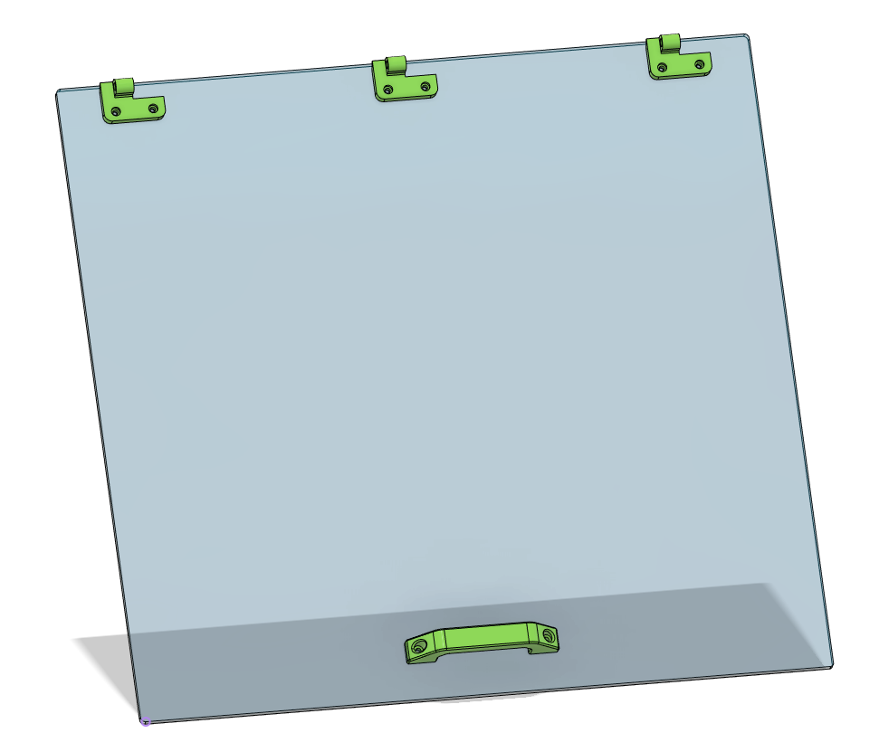

# Assembly

## Table of Contents

* [Prep Work](#Prep-Work)
	* [Tapping and Assembling the X and Z Axis Assembly](#x-and-z-axis-sub)
	* [Assembling the X and Z Axes](#assembling-the-z-and-z-Axes)
* [Making the Cr8](#cr8-atart)
	* [Cr8 Assembly](#cr8-assembly)
* [Y Axis Start](#y-axis-Start)
* [Window](#window)
* [Spindle Mount](#spindle-mount)

## Prep Work

3d-print all your 3D printed parts per the [instructions](printing.md).

Make sure you have two of all the jigs marked 2x in the Fusion360 Project. Pre-drill all the holes. Most can be predrilled with a 1/4" bit. Use an 1/8" bit for smaller holes. The only holes that should be pre-drilled smaller than 1/8" are for the M2 screws that hold in the limit switches.

## X and Z axis Sub

### Punch, Drill and Tap the X-Axis 

Take a look at your 4x1.5x18" steel tube and see if one side is flatter along the 4" length than the other.

If one side is noticeably flatter, set up your printed X-Axis jigs and linear rails on that side. 

We recommend using a 3.5 mm transfer punch to make a light mark for each of the holes, and then enlarging those holes slightly with a center punch. 

Drill all 16 holes for each rail, and tap with an M3 0.5 tap and plenty of tapping fluid. There is an M3 tap guide in the jigs folder on the github to help keep the tap straight. You may have to adjust the scale slightly depending on the settings and nozzle size on your 3D printer.

At this point, you can start screwing down your rails to the tube with M3x10 SHCS and check if the rails are flat. It's not uncommon for the rails to both be tilted in toward the center of the axis. If this is the case (or if they are otherwise out of parallel with each other) check out the [shimming](shimming.md) guide.

### Assembling the X and Z Axes

Use 16 M3x10 SHCS to bolt the Z to X Plate to the carriage.  

M3 nuts pressed into X Lead Nut mount.
M3x12 SHCS to bolt the X Lead Nut to Z to X plate.

M2x12mm bolts to attach the limit switch to the Z Linear Motor Mount. You cannot attach the limit switch once the Z Motor Mount is attached to the Z to X Plate.
Solder wires before bolting. The "Normally Closed" (NC) configuration is recommended for best safety practices.
Run wire for the Z limit switch through slot in the Z Linear Motor Mount. 

M3x10 screws into motor, through the Z Linear Motor Mount. You cannot attach the Z Motor after the Linear Motor Mount is attached to the Z to X Plate.  
Make sure lead nut is mounted now, it's a real pain to mount it later. 

M4x12 SHCS to through the Z Linear Motor Mount to the Z to X Plate  
Use M4 self tapping screws if using plastic plates

Use M4x12 SHCS to attach the Z Lead Nut Mount to the Z Plate.
Insert M5 nylock nuts into the Z Plate now. It is impossible to insert these once the Z Plate is mounted on the carriage. If they are loose, you can hold them in place with M5 screws until you attach the tram plate and router mount.

Use M3x10 SHCS, or M3 self-tapping screws to attach the Z Linear Rails to the Z Plate.

Put two Z bearings on each Z rail.

Put 1 Z Spacer over each set of bearings.
Drill out the bolt holes if needed to make sure the M3 bolts slip through cleanly  

Use M3x10 SHCS attach the Z Plate to the bearing blocks through the spacers.

Use M3x10 SHCS tp attach the Z Lead Nut Mount to the Z Plate. Use the holes in Z Linear Motor Mount to slip allen key through and access bolts. You may have to rotate the lead screw to properly align the Z Lead Nut Mount in order to screw in the bolts.

Solder the wires to the X limit switch and attach the X limit switch to the X Tube Left Idler with M2 screws. Do not attach the left X Tube Left Idlder to the X Tube at this time.

## Cr8 Start

Check the length of your X-tube. Midwest Steel has a tendency to cut the tubes 1/8" long. So you'll either need to file that down, or increase the width of the front, back, top, and bottom by 1/8" to compensate. 

A soft recommendation is to get the crate parts cut on a CNC. There are a lot of holes to drill and it's easier to get them all aligned if it's done by a computer. That said, there are also large format [PDFs](../Panel_Drawings/pdfs) to print and attach to the panels with spray adhesive that work as good guides. It's very possible to make it with hand-drilled holes in the crate, it's just harder.  

### Cr8 Assembly

Use the dowel jig in the large holes on the frame drill the holes on the edge that the 1/4" bolts will go through and thread into the dowel nuts.

Drill the holes about 10mm past the dowel nut hole to allow for bolt clearance

Build up Cr8 with 3 sides like this, the right side (from the front), the bottom, and back.

Put lock washer, and nuts on one end of each of 2 threaded rods  

Put the two threaded rods through the X holes on the right side of the crate.

Lie the crate on the right side, with the threaded rod, washer, and nuts off the table, so it lies flat.

Attach the X Tube Right Motor Cap to the right side of the X Tube. Sometimes the cap will need to be pounted in with a mallet, if it's tight, use a 2x4 over the plastic to avoid damaging it.

Slide the X-Z Sub-Assembly over the threaded rods all the way down. This can be a little fiddly but this is the easiest way. Thread the threaded rod through the X Tube Left Idler cap, and then place the X Tube Left Idler cap over the open left end of the X Tube, use the 2x4 and mallet method to secure it.

Attach the left side of the crate. Add a lock washer and nut to each threaded rod on the left side. 

 

## Y Axis Start

We recommend using a 3.5 mm transfer punch to make a light mark for each of the holes, and then enlarging those holes slightly with a center punch. You can also use the rail punch jig to help align the holes.

Drill, and tap all holes. Use the tap jig as before, if you would like some help keeping the tap straight.

Use M5x25 SHCS in the middle holes of the mounts, secure with a M5 lock nut on the opposite side.  

Slide the last two threaded rods in the outer holes through the tubes. Ive found it can be helpful to lay the frame on it's back so you are droppin the threaded rod through the holes.  

Like with the X tube, it's easiest to thread the threaded rod through only one plastic tube cap, and to leave the other side of the tube open. Once the threaded rod is through the tube cap, thread it through the other cap, and press that threaded tube cap on to the tubes. Attach the remaining cap and tubes to the crate. 

Press 1 608 bearing into the front and back of each thrust block for the X and Y axes.  

Put the coupler on the motor shaft 10.5mm (ish) from the motor face

Slide the locking shaft collar and one M8 washer onto the leadscrew and then slide the leadscrew through the thrust block.

On the inside of the thrust block, slide the thrust bearing stack onto the lead screw and then tighten the coupler onto the lead screw.

Use 4 - M3x50 SHCS to bolt through the thrust block to the motor

Pull the lead screw away from the motor and press the shaft collar against the thrust block while tightening the set screw. - the goal is to remove the possibility for axial play. 

Solder the wires for the limit switch and use an M2x12 SHCS to bolt it the thrust block with 2 small holes in the side.  

Put the coupler on the motor shaft 11.5mm (ish) from the motor face

Slide the shaft collar and one M8 washer onto the leadscrew and then slide the leadscrew through the thrust block.

On the inside of the thrust block, slide the thrust bearing stack onto the lead screw and then tighten the coupler onto the lead screw.

Use 4 - M3x50 SHCS to bolt through the thrust block to the motor

Pull the lead screw away from the motor and press the shaft collar against the thrust block while tightening the set screw. - the goal is to remove the possibility for axial play. 

Y Leadnut mount - press M3 nuts into the pockets and screw to the leadnut

Use M3x16 FHCS for all the carriages and lead nut mount. You may need M3x20 for the lead nut mount.

Loosen all the screws on one side to make it easier to slide the top in and loosely bolt it in.  

## Window

Screw all the window mounts to the Cr8 with 3/4" wood screws. Pay attention to the hinge mount holes on the top mounts. 

Use M3x12 SHCS to bolt through the window.

Use M3 plastic tap screws or M3 SHCS to bolt the hinges to the top mounts.

Use M5x25 SHCS for hinge pins

## Spindle mount

Use M5x20 FHCS to bolt through the back of the tram plate to the spindle mount

Add the 4 90-degree brackets that came with the spindle mount to the top and bottom of the mount and tram plate.

Use 4 M5x16 bolts to bolt the tram plate to the Z Plate. One of the 4 M5 holes is on size and the other 3 are overside to allow for small adjustments of tilt on the spindle
